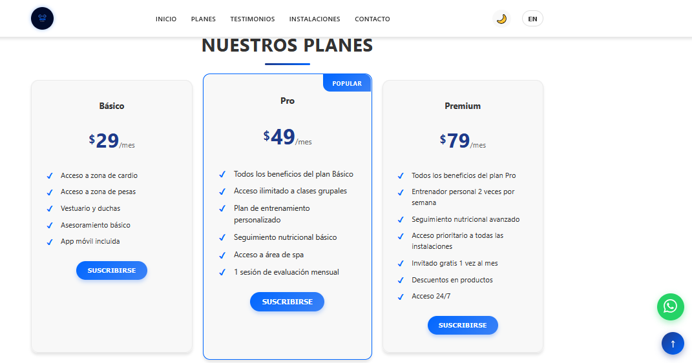

# 🏋️‍♂️ Iron Flex Gym
**Iron Flex** es una **landing page profesional para un gimnasio**, creada con **HTML, CSS y JavaScript puro**.  
Su objetivo es mostrar un sitio moderno, fluido e interactivo que simula la experiencia real de un centro deportivo premium, combinando **diseño, funcionalidad y enfoque comercial**.

## 🌐 Demo
[](https://ramirezthomasalan.github.io/iron-flex/)

## 🏛️ Descripción
Iron Flex ofrece una experiencia completa para usuarios interesados en comenzar o mejorar su entrenamiento.  
Incluye **planes detallados**, **calculadora de IMC**, **testimonios dinámicos**, **galería interactiva**, **formulario de contacto** y un diseño que se adapta perfectamente a cualquier dispositivo.

Además, incorpora una **pantalla de carga**, **modo oscuro**, sistema de tooltips y navegación adaptada tanto a desktop como mobile.

## 📸 Captura de Pantalla


## 💡 Características principales
* 🏆 **Pantalla de carga animada** con texto personalizado.
* 🌗 **Modo oscuro/claro** con botón de alternancia.
* 📱 **Navbar responsive** con menú mobile.
* 🧭 Scroll suave entre secciones.
* 💳 **Sección de planes** con cards limpias y botón de suscripción dinámico.
* 🧮 **Calculadora de IMC** con tabla comparativa y mensajes personalizados.
* ⭐ **Testimonios dinámicos** cargados con JavaScript y slider integrado.
* 🖼️ **Galería generada dinámicamente**, adaptable y ordenada.
* 📩 **Formulario de contacto** con casilla de suscripción.
* 🗺️ Mapa ilustrativo con ubicación referencial del gimnasio.
* ⚡ Animaciones suaves al hacer scroll.
* 💬 Tooltip global interactivo.
* 🔐 Código organizado, escalable y fácil de editar.

## 📂 Estructura del Proyecto
```
│── index.html
│── styles.css
│── script.js
│── assets
│   ├── imágenes del gimnasio
│   ├── íconos y logos
│── preview.png
└── README.md
```

## 🛠️ Tecnologías utilizadas
* **HTML5** → Estructura semántica y limpia.
* **CSS3** → Animaciones, responsive design, modo oscuro y componentes visuales.
* **JavaScript** → Lógica del slider, IMC, galería, validaciones y navegación dinámica.
* **Google Fonts / Custom Icons** → Íconos y tipografías modernas.

## 📦 Funcionalidades JavaScript destacadas
* Carga dinámica de testimonios e imágenes.
* Sistema de slider con controles.
* Calculadora de **IMC** con interpretación automática del resultado.
* Animaciones de entrada al hacer scroll.
* Menú mobile con apertura/cierre fluida.
* Navegación con `scrollToSection()` para una experiencia más intuitiva.

## 👨‍💻 Desarrollador
Proyecto desarrollado por **Thomas Ramírez**, Desarrollador Web Frontend experto en **Landing Pages, SEO, Responsive Design y Marketing Digital**.

Creado como parte de su portafolio profesional para mostrar habilidades en diseño, interacción y optimización web.

## 🌐 Redes sociales
[LinkedIn](https://www.linkedin.com/in/thomas-alan-ramirez/) |  [Fiverr](https://es.fiverr.com/aramirezthomas?public_mode=true) |  [Facebook](https://www.facebook.com/profile.php?id=61575025664166) |  [Reddit](https://www.reddit.com/user/Late-Put-9295/)

## 🤝 ¿Querés una landing así para tu negocio?
Podés encargar una landing profesional **por solo $10 USD** desde mi perfil de Fiverr:
👉 [Visita mi Fiverr](https://es.fiverr.com/aramirezthomas)

## ⚠️ Aviso legal
> Este sitio web es un **proyecto ficticio** con fines demostrativos.  
> Los textos, precios y datos son únicamente de ejemplo.

## 📝 Licencia
Este proyecto está bajo la **MIT License**, libre para usar, modificar y compartir.

## ⭐ ¿Te gustó el proyecto?
Si te gustó **Iron Flex**, ¡dejá una ⭐ en GitHub y compartilo!

# 💪 ¡Gracias por visitar **Iron Flex Gym**!